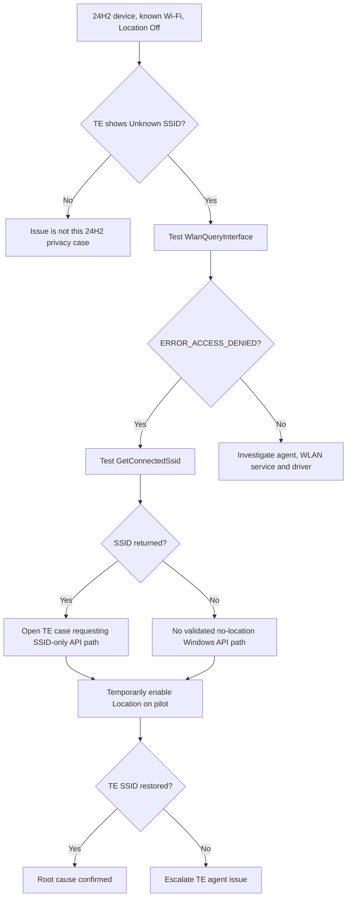

# ThousandEyes SSID Loss After Windows 11 24H2

## Executive summary

The break is caused primarily by a deliberate Windows 11 24H2 privacy change, not by a ThousandEyes regression or a Wi-Fi driver/NDIS change.

Starting with the Windows feature release in fall 2024, Microsoft began enforcing precise-location consent around Wi-Fi APIs capable of exposing BSSID or scan data. On 24H2, calls such as `WlanQueryInterface(...wlan_intf_opcode_current_connection)`, `WlanGetNetworkBssList`, `WlanGetAvailableNetworkList`, and `WlanScan` return `ERROR_ACCESS_DENIED` when the caller lacks the required location consent. Microsoft introduced the behavior in Insider builds in October 2023 specifically because nearby BSSIDs can be used to infer precise physical location. citeturn14search1turn14search9

ThousandEyes has explicitly documented the resulting behavior: on Windows 11 24H2 and later, it recommends enabling Location Services for accurate SSID/BSSID reporting. Without Location Services, Endpoint Agent displays fixed `Unknown SSID` and `Unknown BSSID` values. citeturn13search3

My assessment:

| Question | Finding |
|---|---|
| Why did 23H2 work but 24H2 fail? | 24H2 enforces the new WLAN/location privacy boundary. High confidence. citeturn14search1 |
| Is this primarily an NDIS/driver change? | No evidence supports this. The documented change is at the Windows WLAN/privacy API layer above the miniport driver. citeturn19view3turn16search1 |
| Can current ThousandEyes restore SSID while device-wide Location Services remains Off? | No supported administrative method is documented by Microsoft or ThousandEyes. citeturn13search3turn14search1 |
| Could ThousandEyes itself support SSID without BSSID/location in the future? | Potentially. Microsoft explicitly directs apps needing only the connected SSID to `WlanConnectionProfileDetails.GetConnectedSsid()`. citeturn14search1turn14search2 |
| Can registry/GPO/MDM per-app exceptions bypass globally disabled Location? | No supported mechanism found. App permission is subordinate to the device-level Location setting. citeturn14search1turn18search0 |
| Best practical solution | Enable Location Services on managed endpoints, tightly control app access, and accept the Windows privacy model. If policy forbids this, keep Location off and ask ThousandEyes to implement an SSID-only `GetConnectedSsid()` path. |

The important distinction is SSID versus BSSID. Microsoft intentionally protects BSSID because it can locate a device. Microsoft provides an SSID-only API as the migration path for applications that do not need BSSID. ThousandEyes currently documents Location Services as required for both values. citeturn14search1turn13search3

## Root cause

### Windows 24H2 privacy enforcement

Microsoft's API-change documentation is unusually explicit. Windows considers Wi-Fi BSSID information location-sensitive because databases of nearby AP MAC addresses can infer precise physical location. The behavior first appeared in Insider builds in October 2023 and was scheduled for the fall 2024 feature release, matching Windows 11 24H2. citeturn14search1

Without precise-location consent, 24H2 changes these calls:

| API | 24H2 behavior without required consent |
|---|---|
| `WlanQueryInterface` with `wlan_intf_opcode_current_connection` | `ERROR_ACCESS_DENIED` citeturn14search1turn14search9 |
| `WlanGetNetworkBssList` | `ERROR_ACCESS_DENIED` citeturn14search1turn13search11 |
| `WlanGetAvailableNetworkList` | `ERROR_ACCESS_DENIED` citeturn14search1 |
| `WlanScan` | `ERROR_ACCESS_DENIED` citeturn14search1 |
| `Windows.Devices.WiFi` APIs | `DeniedBySystem` or access-denied exception citeturn14search1turn14search5 |
| `NetworkInformation.GetLanIdentifiers()` | WLAN-related information omitted citeturn14search1 |
| `WlanRegisterNotification` with MSM notifications | Can require `wiFiControl`, which itself requires location consent citeturn14search1 |

This explains an important symptom: the PC can remain connected to Wi-Fi and Windows itself still knows the network, while a third-party monitoring process loses access to the WLAN metadata it previously read.

Community reports match the official behavior. Windows 11 24H2 applications using Native Wi-Fi have reported `Access denied`, with access restored after enabling Location Services. Microsoft Tech Community users also began noticing the 24H2 location-use indication associated with these changes. citeturn12search4turn15search1

### SSID is a special case

Microsoft specifically says applications that need only the connected SSID should use:

`Windows.Networking.Connectivity.WlanConnectionProfileDetails.GetConnectedSsid()`

Microsoft documents this API as returning the SSID of the current WLAN connection and recommends it as the alternative when an application needs SSID rather than location-capable Wi-Fi scanning/BSSID data. citeturn14search1turn14search2turn14search4

This is the strongest route to preserving SSID reporting without granting BSSID access.

There is one caveat. Microsoft's documentation recommends `GetConnectedSsid()` in the location-change article, but it does not provide an explicit guarantee on that page that every 24H2 servicing build will return SSID while the device-level Location Services switch is globally Off. Therefore, validate this API directly on your production build. The test below does exactly that. citeturn14search1turn14search2

### Driver, NDIS, and scanning changes

There is no strong evidence this ThousandEyes symptom comes from a 24H2 NDIS regression.

The Windows WLAN architecture is layered:

```text
Endpoint Agent
    |
Win32 WLAN / WinRT networking APIs
    |
24H2 privacy and capability enforcement
    |
WLAN AutoConfig / Native Wi-Fi stack
    |
WiFiCx or WDI
    |
Vendor miniport driver
    |
Wi-Fi NIC
```

Microsoft describes the Native Wi-Fi stack as wireless APIs plus WLAN AutoConfig interacting with wireless miniports. Windows 11's newer driver model is WiFiCx, while WDI is now maintenance mode. WiFiCx scan operations still obtain BSS entries, BSSID, channel and signal information from the adapter. Nothing in those driver documents identifies a new 24H2 restriction responsible for user-mode SSID disappearance. citeturn19view3turn16search1

The privacy gate therefore sits logically above the radio/driver scan operation. A newer Intel, Qualcomm, Realtek, or OEM driver can affect actual Wi-Fi connectivity and scanning, but changing drivers should not bypass the documented location-consent requirement. citeturn14search1turn19view3

## ThousandEyes behavior and likely API dependency

ThousandEyes now has a dedicated Windows 11 24H2 note stating that Location Services should be enabled to accurately report the connected access point's SSID or BSSID. Otherwise Endpoint Agent reports `Unknown SSID` and `Unknown BSSID`. citeturn13search3

ThousandEyes' publicly available documentation does not identify the exact Windows call used internally. I found no primary vendor statement saying, for example, "Endpoint Agent obtains the SSID through `WlanQueryInterface`."

The most likely possibilities are Windows WLAN/WinRT surfaces affected by Microsoft's new policy. This inference is supported by the exact correspondence between Microsoft's 24H2 access restrictions and ThousandEyes' 24H2-specific requirement, but the exact internal call should be treated as unverified until Cisco ThousandEyes confirms it. citeturn14search1turn13search3

A particularly plausible implementation is `WlanQueryInterface(...wlan_intf_opcode_current_connection)`, because it traditionally returns current WLAN connection attributes including the SSID/BSSID and is now explicitly blocked without location consent. This is an inference, not a documented ThousandEyes implementation detail. citeturn14search9turn14search1

The distinction matters because Microsoft now recommends applications split requirements:

```text
Need current SSID only
        |
        v
GetConnectedSsid()
Potentially avoids requesting BSSID-sensitive WLAN data

Need BSSID / scans / neighboring APs
        |
        v
Native Wi-Fi / Windows.Devices.WiFi
        |
        v
Precise-location consent required
```

citeturn14search1turn14search2

For ThousandEyes, this would require a product change. An admin cannot force Endpoint Agent to use a different API unless ThousandEyes provides such a configuration.

## Workarounds and feasibility

Assuming you can use GPO, Intune/MDM, scripts, ConfigMgr or equivalent tooling, these are the realistic options.

| Approach | SSID impact | Location/privacy impact | Complexity | Reversible | Required privilege | Assessment |
|---|---|---|---|---|---|---|
| Enable device Location Services | Restores TE's documented supported path | Location-capable APIs become available subject to additional app policy | Low | Yes | Admin/MDM | Recommended supported fix. citeturn13search3turn14search1 |
| Enable Location, restrict apps with GPO/MDM | Should restore TE if desktop-process consent is satisfied | Better control than unrestricted location | Medium | Yes | Admin/MDM | Best enterprise compromise. Microsoft supports Location app policies, although PFN allowlists target Windows apps. citeturn18search0 |
| Keep global Location Off, set per-app registry Allow | Usually insufficient | Global privacy control remains authoritative | Low | Yes | User/Admin | Not a supported bypass. citeturn14search1 |
| `DisableLocation=0` GPO/registry | Removes a policy-level prohibition | Does not by itself prove the device Location toggle is enabled | Low | Yes | Admin | Useful only if GPO caused Location to be disabled. citeturn10view3turn10view4 |
| CapabilityAccessManager registry manipulation | Can enable Location or desktop-app access | Often equivalent to turning Location on | Medium | Yes, if backed up | Admin/SYSTEM | Supported registry locations exist, but this does not create a clean "TE only while Location Off" exception. citeturn10view2 |
| Community `SystemSettingsAdminFlows.exe SetCamSystemGlobal location 1` | Reported to enable Location | Explicitly enables Location | Medium | Yes | Admin | Community workaround, undocumented interface, avoid as strategic configuration. citeturn18search3turn20search5 |
| Ensure WLAN AutoConfig is running | Required for normal Windows WLAN operation | No privacy bypass | Low | Yes | Admin | Necessary plumbing, not a fix for 24H2 authorization. citeturn19view3turn13search5 |
| Add `wiFiControl` manifest capability | Could support Wi-Fi API usage in an app you control | Capability now also requires location consent | Dev change | Yes | Developer/signing | Does not solve TE and does not bypass 24H2. citeturn14search1turn14search5 |
| Change TE to `GetConnectedSsid()` | Strong candidate for SSID-only operation | Avoids requesting BSSID/scanning data | Vendor engineering | Yes | ThousandEyes | Best long-term no-location design to request from Cisco. citeturn14search1turn14search2 |
| Wi-Fi Direct | No meaningful benefit | Still part of Windows Wi-Fi stack | High | Yes | Varies | Wrong abstraction. Wi-Fi Direct concerns peer connections, not a supported way to read the infrastructure WLAN SSID around privacy enforcement. citeturn16search1turn13search23 |
| Custom user-mode helper using affected Native WLAN calls | Still blocked | Same location gate | High | Yes | User/Admin | No advantage. citeturn14search1 |
| Custom helper using `GetConnectedSsid()` | Could independently obtain SSID if your build permits it with Location Off | Lower privacy exposure | Medium | Yes | Standard user likely sufficient for test | Technically promising, but ThousandEyes has no documented ingest mechanism for substituting this value. citeturn14search2 |
| Parse WLAN AutoConfig logs as a custom inventory source | Potentially recover connected-network context | Avoids direct WLAN scan APIs | Medium/High | Yes | Read event log, potentially admin | Unsupported for TE integration and susceptible to stale/history data. WLAN AutoConfig logs do contain connection/profile information. citeturn19view4 |
| Raw NDIS/WiFiCx/kernel driver | Could theoretically see data below user-mode privacy layer | Deliberately circumvents the OS privacy boundary | Very high | Difficult | Kernel driver, signing, SYSTEM | Do not pursue. Operational, security and servicing risk are disproportionate. WiFiCx interfaces are driver-level mechanisms, not a supported privacy exemption for user applications. citeturn16search1turn13search22 |

### Registry and policy hierarchy

The useful settings are easy to confuse.

Microsoft documents device and user capability consent under `CapabilityAccessManager`. For example, device-level Location Services and user/desktop-app location consent exist at different scopes. citeturn10view2

Typical relevant state includes:

```text
HKLM\SOFTWARE\Microsoft\Windows\CurrentVersion\
  CapabilityAccessManager\ConsentStore\location

HKCU\Software\Microsoft\Windows\CurrentVersion\
  CapabilityAccessManager\ConsentStore\location

HKCU\Software\Microsoft\Windows\CurrentVersion\
  CapabilityAccessManager\ConsentStore\location\NonPackaged
```

Microsoft's documented location policy also uses:

```text
HKLM\SOFTWARE\Policies\Microsoft\Windows\LocationAndSensors
    DisableLocation
```

citeturn10view2turn10view3

Do not treat `DisableLocation=0` as equivalent to granting ThousandEyes access. It means policy is not forcing the location feature off. The privacy/capability state still matters. Microsoft's API documentation describes consent as operating at device, user and app levels. citeturn14search1

The Privacy CSP offers `LetAppsAccessLocation`, `ForceAllowTheseApps`, `ForceDenyTheseApps`, and `UserInControlOfTheseApps`. The documented application-specific mechanisms use Windows app identities/package family names. This makes them much cleaner for packaged apps than for a traditional Windows monitoring service such as Endpoint Agent. citeturn18search0

Community administrators have tried combinations such as `LetAppsAccessLocation`, `LetDesktopAppsAccessLocation`, LocationAndSensors keys, Location service configuration, and `SystemSettingsAdminFlows.exe`. Reports are mixed, especially on 24H2. Importantly, the workarounds that reliably turn the feature back on are really ways of enabling Location, not ways of bypassing Location while leaving it disabled. citeturn18search3turn18search7turn20search5

### Security tradeoff

Microsoft is protecting BSSID for a legitimate reason. An AP's globally observable identifier can be mapped against Wi-Fi geolocation databases and used to determine device location. This is why BSSID, scans and APIs exposing nearby APs are behind precise-location consent. citeturn14search1

An SSID is less precise. Many organizations reuse SSIDs such as `CorpWiFi` at hundreds of sites. Microsoft's decision to recommend `GetConnectedSsid()` for SSID-only applications reflects this distinction. citeturn14search1turn14search2

A raw NDIS or custom kernel workaround would defeat the security boundary Windows intentionally added. It also creates driver-signing, HVCI/Memory Integrity, upgrade compatibility and supportability concerns. WiFiCx and WDI are driver interfaces managed by the Windows networking stack, not normal alternatives to application-level privacy controls. citeturn16search1turn13search22

## Test plan

Use one 23H2 reference device and at least two identical 24H2 pilots if possible. Keep the NIC model and driver version aligned where practical. This cleanly separates OS privacy behavior from driver changes.

| Test | Steps | Expected result | Rollback | Collect |
|---|---|---|---|---|
| Establish baseline | 24H2, connected to known SSID, Location Off. Confirm TE `Unknown SSID`. | TE reproduces issue. | None | OS build, TE agent version, NIC/driver, TE screenshot. citeturn13search3 |
| Native WLAN test | Call `WlanQueryInterface(current_connection)`, `WlanGetNetworkBssList`, optionally `WlanScan`. | `ERROR_ACCESS_DENIED` with Location consent absent. | None | Exact Win32 return codes and process identity. citeturn14search1 |
| SSID-only API test | On same PC and state, call `WlanConnectionProfileDetails.GetConnectedSsid()`. | Critical result. If SSID returns, a vendor-level no-location path exists. | None | Returned SSID/error plus OS build. citeturn14search1turn14search2 |
| Location causality test | Enable device Location on one 24H2 pilot. Ensure applicable app/desktop permissions. Restart TE service or reconnect Wi-Fi. | TE SSID/BSSID should return according to ThousandEyes documentation. | Restore original Location/privacy state. | TE before/after, registry/policy state, service timestamps. citeturn13search3 |
| Driver control | Repeat with same Location state before and after NIC driver change. | Privacy-denied API behavior should remain tied to Location state, not driver. | Restore approved driver. | Driver version and API results. citeturn19view3turn16search1 |
| Policy granularity test | Location On, then apply your proposed MDM/GPO app restrictions. | Determine whether TE still has access while other apps are restricted. | Remove test policy and sync MDM/GPO. | `gpresult`, MDM diagnostics, relevant registry values, TE result. citeturn18search0 |
| No-location fallback | Location Off again. Test SSID-only utility and optionally WLAN AutoConfig event correlation. | Establish whether SSID can be independently retrieved without giving BSSID access. | Remove utility/log collection. | API output and WLAN AutoConfig Operational events. citeturn14search2turn19view4 |

Collect at minimum:

`winver`/full OS build, Endpoint Agent version, NIC make/model/driver version, Location Services state, relevant App Privacy and LocationAndSensors policies, the exact WLAN API error code, service/user execution context, and `Microsoft-Windows-WLAN-AutoConfig/Operational` around connection and agent collection times. Microsoft identifies the WLAN AutoConfig Operational log as containing wireless adapter, connection profile, authentication and failure information. citeturn19view4

For ThousandEyes, preserve Endpoint Agent diagnostics/support bundle plus screenshots or exports showing the device's SSID field before and after each state change. ThousandEyes' current Windows documentation should be included in the support case because it directly acknowledges the 24H2 requirement. citeturn13search3



## Recommended solution

For production today, use the Microsoft and ThousandEyes-supported route:

Enable Windows Location Services on managed Endpoint Agent devices, then restrict location access as tightly as your enterprise policy permits. Do not enable broad Wi-Fi scanning in custom tools. ThousandEyes itself recommends Location Services on Windows 11 24H2+ for SSID/BSSID reporting. citeturn13search3turn14search1

If the requirement is absolute, "device-level Windows Location must remain Off," accept that current ThousandEyes SSID/BSSID reporting will remain unavailable unless Cisco changes Endpoint Agent. Open a ThousandEyes support/RFE case asking specifically:

> On Windows 11 24H2+, use `Windows.Networking.Connectivity.WlanConnectionProfileDetails.GetConnectedSsid()` for SSID-only reporting when precise-location/BSSID access is denied, while continuing to report BSSID as Unknown.

That request follows Microsoft's own application-migration guidance. citeturn14search1turn14search2

Fallback order:

1. SSID required, BSSID unnecessary: request the ThousandEyes `GetConnectedSsid()` implementation and validate the API on your exact 24H2/25H2 build first. citeturn14search1turn14search2
2. SSID and BSSID required: enable Location Services. There is no supported Windows 24H2 bypass because BSSID access is intentionally location-gated. citeturn14search1
3. Location cannot be enabled and you only need inventory/site identification: collect SSID separately with a managed helper if `GetConnectedSsid()` passes your pilot test, or derive site from corporate network information outside ThousandEyes. Do not build a kernel/NDIS bypass solely for this problem.
4. Avoid registry ACL hacks, undocumented privacy-service manipulation and raw driver approaches. They create unsupported state without addressing the underlying 24H2 permission contract. Community registry workarounds mainly succeed by turning Location back on. citeturn20search5turn18search7

## Key primary sources

1. Microsoft, Changes to API behavior for Wi-Fi access and location

This was the most important source. Microsoft confirms Windows now restricts Wi-Fi APIs capable of exposing BSSID/location data unless precise location access is allowed. It also lists the affected APIs and recommends an SSID-only alternative.

[https://learn.microsoft.com/en-us/windows/win32/nativewifi/wi-fi-access-location-changes](https://learn.microsoft.com/en-us/windows/win32/nativewifi/wi-fi-access-location-changes)

2. Cisco ThousandEyes, Installing the Endpoint Agent on Windows

ThousandEyes explicitly confirms the Windows 11 24H2 behavior. It states Location Services should be enabled for accurate SSID/BSSID reporting, otherwise Endpoint Agent can show Unknown SSID and Unknown BSSID.

[https://docs.thousandeyes.com/product-documentation/global-vantage-points/endpoint-agents/installing/windows/install-the-endpoint-agent-on-windows](https://docs.thousandeyes.com/product-documentation/global-vantage-points/endpoint-agents/installing/windows/install-the-endpoint-agent-on-windows)

3. Microsoft, WlanConnectionProfileDetails.GetConnectedSsid()

Microsoft documents the alternative API for obtaining only the currently connected SSID. This is important because Microsoft specifically recommends it when an application only needs the SSID rather than BSSID or nearby Wi-Fi information.

[https://learn.microsoft.com/en-us/uwp/api/windows.networking.connectivity.wlanconnectionprofiledetails.getconnectedssid?view=winrt-28000](https://learn.microsoft.com/en-us/uwp/api/windows.networking.connectivity.wlanconnectionprofiledetails.getconnectedssid?view=winrt-28000)

4. Microsoft, WlanConnectionProfileDetails class

Supporting documentation for the SSID-only Windows networking interface. It helps establish the supported Windows API path ThousandEyes could potentially use instead of an API requiring precise-location access.

[https://learn.microsoft.com/en-us/uwp/api/windows.networking.connectivity.wlanconnectionprofiledetails?view=winrt-28000](https://learn.microsoft.com/en-us/uwp/api/windows.networking.connectivity.wlanconnectionprofiledetails?view=winrt-28000)

5. Microsoft, WlanQueryInterface

This API can return information about the current wireless connection, including data associated with SSID/BSSID. Microsoft specifically documents newer location restrictions around some uses of this API, making it a plausible API behind the ThousandEyes issue.

[https://learn.microsoft.com/en-us/windows/win32/api/wlanapi/nf-wlanapi-wlanqueryinterface](https://learn.microsoft.com/en-us/windows/win32/api/wlanapi/nf-wlanapi-wlanqueryinterface)

6. Microsoft, WlanGetNetworkBssList

This retrieves BSS information from Wi-Fi networks. Windows 24H2 restricts access because BSSID information can be used to determine a device's physical location.

[https://learn.microsoft.com/en-us/windows/win32/api/wlanapi/nf-wlanapi-wlangetnetworkbsslist](https://learn.microsoft.com/en-us/windows/win32/api/wlanapi/nf-wlanapi-wlangetnetworkbsslist)

7. Microsoft, WlanScan

This documents the Native Wi-Fi scanning API. It is one of the Wi-Fi operations affected by Microsoft's newer location privacy controls.

[https://learn.microsoft.com/en-us/windows/win32/api/wlanapi/nf-wlanapi-wlanscan](https://learn.microsoft.com/en-us/windows/win32/api/wlanapi/nf-wlanapi-wlanscan)

8. Microsoft, Windows.Devices.WiFi

This documents the modern Windows Wi-Fi API surface. It confirms Wi-Fi functionality involving scanning/BSSID is tied into Windows capability and location permission controls.

[https://learn.microsoft.com/en-us/uwp/api/windows.devices.wifi?view=winrt-26100](https://learn.microsoft.com/en-us/uwp/api/windows.devices.wifi?view=winrt-26100)

9. Microsoft, Privacy Policy CSP

This is the key Intune/MDM policy reference. It documents settings such as LetAppsAccessLocation and ForceAllow/ForceDeny application lists, which are relevant if you test enabling Location Services while restricting which apps can consume location.

[https://learn.microsoft.com/en-us/windows/client-management/mdm/policy-csp-privacy](https://learn.microsoft.com/en-us/windows/client-management/mdm/policy-csp-privacy)

10. Microsoft, System Policy CSP

This documents device-level location policy controls, including AllowLocation and the associated Windows policies. Useful for understanding the difference between allowing the Windows location feature and granting individual applications access.

[https://learn.microsoft.com/en-us/windows/client-management/mdm/policy-csp-system](https://learn.microsoft.com/en-us/windows/client-management/mdm/policy-csp-system)

11. Microsoft, ADMX Sensors Policy CSP

This covers policies such as Turn off location and related Location and Sensors settings. It helps identify whether an existing GPO or Intune policy is disabling location at a higher level.

[https://learn.microsoft.com/en-us/windows/client-management/mdm/policy-csp-admx-sensors](https://learn.microsoft.com/en-us/windows/client-management/mdm/policy-csp-admx-sensors)

12. Microsoft, Wireless network connectivity troubleshooting

Useful for understanding the Windows Wi-Fi architecture. It shows WLAN APIs and WLAN AutoConfig sit above the wireless driver, supporting the conclusion that this issue is primarily an OS privacy/API restriction rather than an Intel/Qualcomm/Wi-Fi driver regression.

[https://learn.microsoft.com/en-us/troubleshoot/windows-client/networking/wireless-network-connectivity-issues-troubleshooting](https://learn.microsoft.com/en-us/troubleshoot/windows-client/networking/wireless-network-connectivity-issues-troubleshooting)

13. Microsoft, 802.1X authentication troubleshooting

This documents the WLAN AutoConfig Operational event log. That log is useful during your testing to prove Windows remains connected normally even while ThousandEyes loses access to SSID/BSSID data.

[https://learn.microsoft.com/en-us/troubleshoot/windows-client/networking/802-1x-authentication-issues-troubleshooting](https://learn.microsoft.com/en-us/troubleshoot/windows-client/networking/802-1x-authentication-issues-troubleshooting)

14. Microsoft, WiFiCx OID_WDI_TASK_SCAN

This shows lower-level Wi-Fi drivers still obtain BSS scan information normally. It supports the conclusion that the restriction occurs higher up in the Windows user-mode API/privacy layer.

[https://learn.microsoft.com/en-us/windows-hardware/drivers/netcx/oid-wdi-task-scan](https://learn.microsoft.com/en-us/windows-hardware/drivers/netcx/oid-wdi-task-scan)

15. Microsoft, Overview of NDIS Driver Types

Supporting source for Windows networking architecture. It helped rule out NDIS itself as the likely cause of the ThousandEyes SSID change.

[https://learn.microsoft.com/en-us/windows-hardware/drivers/network/ndis-drivers](https://learn.microsoft.com/en-us/windows-hardware/drivers/network/ndis-drivers)

16. Microsoft Q&A, Native Wi-Fi "Access is denied"

A user reported Native Wi-Fi API calls returning Access Denied under the newer Windows behavior. Enabling Location Services restored access, which closely matches your ThousandEyes symptoms.

[https://learn.microsoft.com/en-us/answers/questions/3910051/system-componentmodel-win32exception-0x80004005-ac](https://learn.microsoft.com/en-us/answers/questions/3910051/system-componentmodel-win32exception-0x80004005-ac)

17. Microsoft Tech Community, 24H2 location activity

Users noticed changed location-related behavior after upgrading to Windows 11 24H2. It provides community confirmation that the feature release changed how location and Wi-Fi-related access is surfaced/enforced.

[https://techcommunity.microsoft.com/discussions/windows11/after-upgrading-to-24h2-a-location-acquisition-process-appeared-in-the-lower-rig/4447664/replies/4448640](https://techcommunity.microsoft.com/discussions/windows11/after-upgrading-to-24h2-a-location-acquisition-process-appeared-in-the-lower-rig/4447664/replies/4448640)

18. Reddit r/Intune, 24H2 changed Location Services state

Admins discuss 24H2 systems showing Location capability state as Deny and attempts to control it through Intune/registry settings. Useful as real-world evidence, but I would treat it as community information rather than authoritative documentation.

[https://www.reddit.com/r/Intune/comments/1o6o1xr/updating_from_22h2_to_24h2_turned_location/](https://www.reddit.com/r/Intune/comments/1o6o1xr/updating_from_22h2_to_24h2_turned_location/)

19. Reddit r/SCCM, Windows 11 24H2 Location Services

Admins discuss registry and command-based approaches for enabling Location Services on managed 24H2 systems. The important finding is most successful "workarounds" actually turn Location back on rather than giving one desktop application a true exception while Location stays disabled.

[https://www.reddit.com/r/SCCM/comments/1rmsh5g/windows_11_24h2_location_services_off_by_default/](https://www.reddit.com/r/SCCM/comments/1rmsh5g/windows_11_24h2_location_services_off_by_default/)

20. MSEndpointMgr, Location Services is grayed out

Enterprise-focused article covering Intune location controls and Force Allow application configuration. Relevant to your possible compromise of enabling the underlying location service while limiting application access.

[https://msendpointmgr.com/2026/02/10/location-services-is-grayed-out/](https://msendpointmgr.com/2026/02/10/location-services-is-grayed-out/)

The three sources I would put at the top of your internal investigation are Microsoft’s Wi-Fi location change document, the ThousandEyes Windows Endpoint Agent document, and the Microsoft GetConnectedSsid API document. Together they establish the cause, ThousandEyes' current supported position, and the most interesting possible SSID-only solution.
